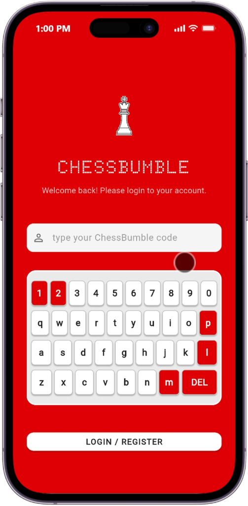
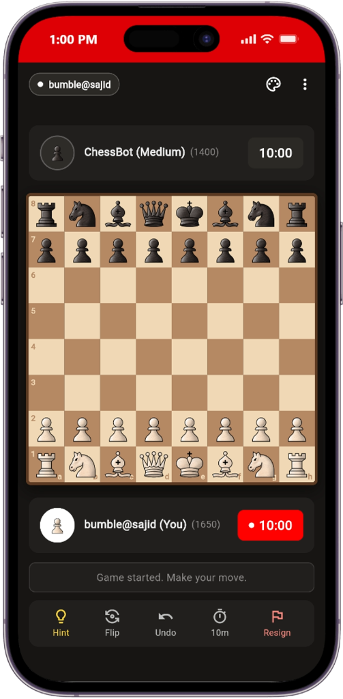
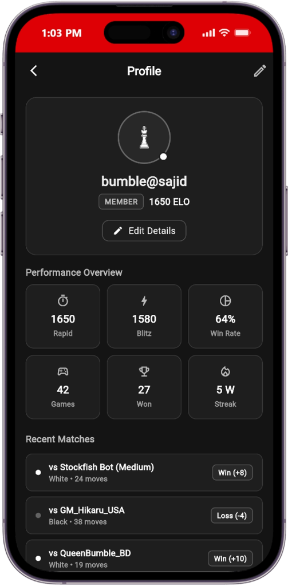
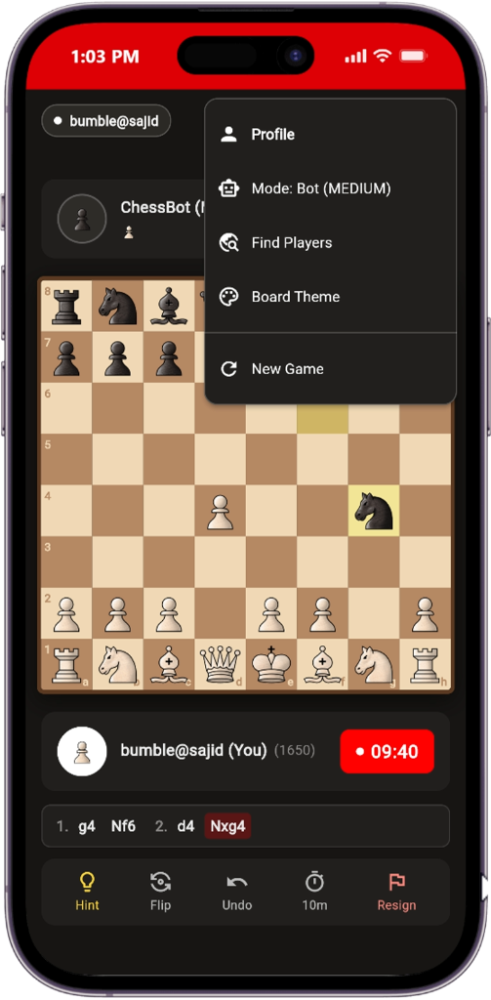
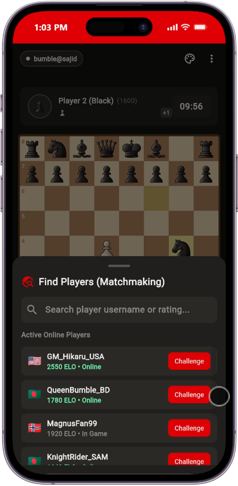
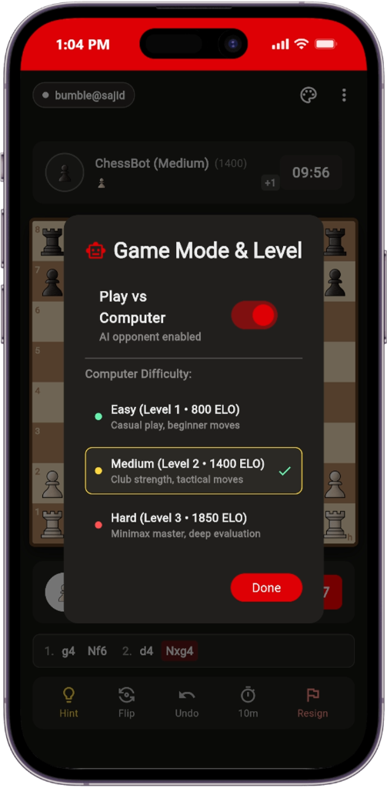
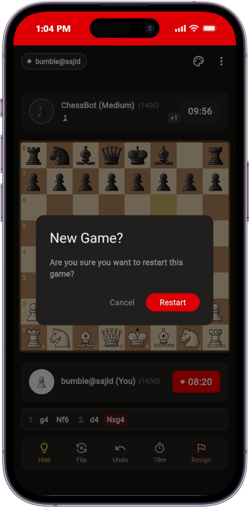
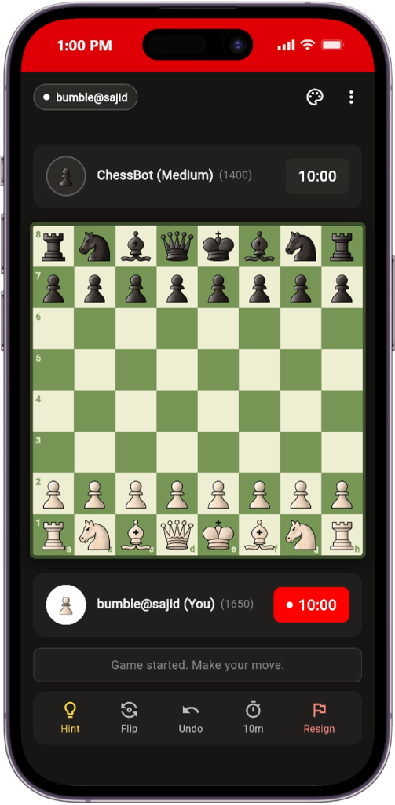
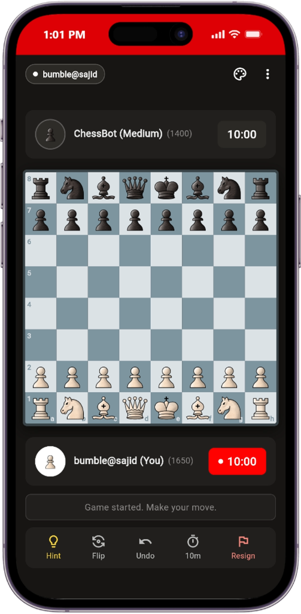

# ♟️ ChessBumble

<p align="center">
  
  
  
</p>

<p align="center">
  <strong>A premium, modern chess platform built with Flutter, intelligent AI bots, dynamic board modes, live player matchmaking, and an encrypted Node.js backend.</strong>
</p>

<p align="center">
  
  
  
  
  
</p>

---

## 📖 Overview

**ChessBumble** is a high-performance chess application featuring a distinctive crimson-and-dark aesthetic. Designed for both casual and competitive chess enthusiasts, the platform offers on-screen keypad authentication, custom ELO-based profile analytics, live player matchmaking, customizable AI bot difficulty with natural human-like deliberation, real-time board themes, and an end-to-end encrypted backend.

---

## 🎮 Core Game Features & App Workflow

### 📋 1. App Navigation & Quick Menu
Access all game features directly from the in-game header menu:
- **Profile Navigation:** One-tap transit to the player's personal dashboard and career stats.
- **Game Mode Selection:** Instant toggle between Bot AI play and multiplayer modes.
- **Find Players (Matchmaking):** Open active matchmaking to challenge other players.
- **Board Themes:** Real-time visual board theme switcher.
- **New Game:** Quick reset option with confirmation safety.

<p align="center">
  
</p>

---

### 👤 2. Player Profile & Performance Analytics
A dedicated career dashboard tracking player growth, ELO rating, and match history:
- **Member Tier & ELO Rating:** Live rating badge (e.g. `1650 ELO`) with editable player details.
- **Performance Overview Grid:**
  - **Rapid & Blitz Ratings:** Independent tracking for fast and standard time controls.
  - **Win Rate:** Percentage-based performance meter (e.g. `64% Win Rate`).
  - **Match Totals:** Total games played, total victories, and active win streaks (e.g. `5 W Streak`).
- **Recent Matches Timeline:** Detailed match log showing opponent name, play color, move count, and ELO change (`+8`, `-4`, `+10`).

<p align="center">
  
</p>

---

### 🌐 3. Live Matchmaking & Find Players
An interactive lobby system for challenging other active chess players:
- **Player Search:** Quick-filter search bar to find opponents by username or rating bracket.
- **Active Online Players List:** Real-time lobby displaying country flags, active status (`Online`, `In Game`), and ELO rankings.
- **Instant Challenge:** One-tap red `Challenge` button to invite opponents to a live duel.

<p align="center">
  
</p>

---

### 🤖 4. Game Modes & Play vs Computer
Fine-tune single-player AI matches with custom difficulty tiers and evaluation depth:
- **Play vs Computer Toggle:** Seamlessly switch between local two-player mode and AI bot opponent.
- **Bot Difficulty Tiers:**
  - 🟢 **Easy (Level 1 • 800 ELO):** Casual play, relaxed positional moves, ideal for warmups and beginners.
  - 🟡 **Medium (Level 2 • 1400 ELO):** Club strength with sharp tactical awareness and balanced piece trades.
  - 🔴 **Hard (Level 3 • 1850 ELO):** Deep Minimax evaluation with positional piece-square tables and aggressive endgames.
- **Human-Like Thinking Time:** AI deliberates between **1.2s to 3.2s** with randomized variance to emulate a real human opponent.

<p align="center">
  
</p>

---

### 🔄 5. New Game & Safe Restart
- **Accidental Reset Prevention:** Custom dark dialog confirming game restart before wiping active board state.
- **Instant Clock & Position Reset:** Resets chess pieces, clears captured piece trays, and restores preset time controls without restarting the app.

<p align="center">
  
</p>

---

## 🎨 Board Themes & Visual Modes

Players can personalize their board at any time via the in-game theme picker:

| 🪵 Classic Wood | 🏆 Tournament Green | 🌑 Slate Minimalist |
|:---:|:---:|:---:|
|  |  |  |
| **Warm Woodgrain**<br>Traditional wooden board aesthetic (`#F0D9B5` / `#B58863`) | **FIDE / Lichess Style**<br>Standard tournament green & ivory mat (`#EEEED2` / `#769656`) | **Contemporary Dark**<br>Modern blue-grey high-contrast palette (`#BAC7D5` / `#708796`) |

> Also includes the **Glossy Liquid Red** theme (`#FFFFFF` / `#CC0004`), matching the app's signature brand red identity.

---

## 🔐 Authentication & On-Screen Keypad

<p align="center">
  
</p>

- **Signature Visual Identity:** Bold crimson background paired with crisp white controls and high-contrast typography.
- **Doto Dot-Matrix Branding:** Custom retro-modern digital branding font.
- **Custom Virtual Keyboard:** Dedicated in-app doodle keyboard with tactile red accent keys (`1`, `2`, `p`, `l`, `m`, `DEL`) for quick and secure code entry.
- **Zero-Friction Access:** Instant login/registration with unique ChessBumble codes.

---

## ⏱️ Dynamic Chess Clocks & Time Controls
- **Vibrant Turn Indicators:** Active player's clock highlights in pure red (`#FF0000`) with a white live dot and borderless finish.
- **Flexible Controls:** Instant switching between **10 min**, **5 min**, **3 min**, and **Unlimited (∞)** timers.
- **Live Move Notation Bar:** Real-time PGN ticker displaying recent moves (`1. g4 Nf6 2. d4 Nxg4`).
- **Interactive Move Hints:** AI-assisted lightbulb button recommending optimal piece moves.

---

## 📸 Complete Visual Showcase

| Feature Menu | Player Profile | Online Matchmaking | Bot AI Settings | New Game Dialog |
|:---:|:---:|:---:|:---:|:---:|
|  |  |  |  |  |

| Login & Keypad | Classic Wood Board | Tournament Green Board | Slate Dark Board |
|:---:|:---:|:---:|:---:|
|  |  |  |  |

---

## 🛠️ Architecture & Tech Stack

```
MSIc/
├── assets/
│   ├── fonts/                  # Custom Doto typography
│   └── images/                 # Logos, chess piece sprites (vectors)
├── backend/                    # Node.js + Express API
│   ├── models/                 # Mongoose schemas (User, PersonInfo)
│   ├── seed_encrypted_data.js
│   └── server.js               # Authentication & info endpoints
├── docs/
│   └── images/                 # App showcase screenshots & modes
│       ├── login_screen.png    # Authentication & virtual keypad
│       ├── app_menu.png        # Header navigation popup
│       ├── profile_screen.png  # Player stats & rating history
│       ├── matchmaking.png     # Live player lobby & challenges
│       ├── game_mode_bot.png   # AI difficulty & game mode modal
│       ├── new_game_dialog.png # Restart confirmation dialog
│       ├── theme_wood.png      # Classic wood board mode
│       ├── theme_green.png     # Tournament green board mode
│       └── theme_slate.png     # Slate dark board mode
└── lib/                        # Flutter Client
    ├── main.dart               # Application theme & route entry
    ├── login_page.dart         # Custom keypad & brand login screen
    ├── home_page.dart          # Interactive chess arena & game engine
    ├── profile_page.dart       # Player career dashboard & stats
    ├── info_feed_page.dart     # AES-256 decrypted announcement feed
    └── services/
        ├── api_service.dart    # HTTP client for backend communication
        └── chess_ai.dart       # Minimax AI bot & hint generator
```

---

## 🚀 Getting Started

### Prerequisites
- **Flutter SDK:** `>= 3.12.2` ([Install Flutter](https://flutter.dev/docs/get-started/install))
- **Node.js:** `>= 18.x` ([Download Node.js](https://nodejs.org/))
- **MongoDB:** Local instance or [MongoDB Atlas](https://www.mongodb.com/cloud/atlas)

---

### 1. Backend Setup

```bash
cd backend

# Install dependencies
npm install

# Configure environment variables (.env file):
# PORT=5000
# MONGODB_URI=mongodb://127.0.0.1:27017/msic
# (or provide DB_USER and DB_PASS for MongoDB Atlas)

# Seed encrypted data (optional)
node seed_encrypted_data.js

# Start backend server
node server.js
```

---

### 2. Flutter App Setup

```bash
# Return to the project root
cd ..

# Install Flutter dependencies
flutter pub get

# Run on an emulator, connected device, or desktop
flutter run
```

---

## 🧪 Testing & Analysis

Run static code analysis to ensure code quality:

```bash
flutter analyze
```

---

## 📄 License

This project is licensed under the MIT License — see the [LICENSE](LICENSE) file for details.
